<div align="center">



# Yasuo

**One window for a project's agents, its board and its diff.**

[](https://github.com/YasuoApp/Yasuo/actions/workflows/ci.yml)
[](LICENSE)
[](https://electronjs.org)

</div>

---

Yasuo runs `claude` against the folders you already work in, and makes each conversation a tab. A project's chats sit under its name, whichever is answering says so, and the diff they leave is a tab in the same window.

Agents run **in the folder itself** — no branch to name, no worktree to remove, nothing to merge back, and what an agent changed is what `git status` says it changed. The cost is that two agents on one folder edit the same files: this is a studio for conversations you are watching, not a farm of them you are not.

One **workspace**, any number of **folders**, no switching between them. Each project has its chats, a board, an Explorer with files and changes, and a terminal; Database and API open in windows of their own. [`docs/design.md`](docs/design.md) is what each one is for and why it behaves as it does.

## Install

Every build is **unsigned**, so each OS objects in its own way. That is what the last line of each section is about.

### macOS

macOS 12 (Monterey) or newer, Apple Silicon or Intel.

```bash
curl -fsSL https://raw.githubusercontent.com/YasuoApp/Yasuo/main/install.sh | bash
```

[`install.sh`](install.sh) picks the build for your architecture and copies it into `/Applications`. Run it again to update, or `| bash -s 1.0.0` to pin a version.

Use `curl` rather than a browser: macOS quarantines a download and Gatekeeper then calls the app _"damaged"_, which only ever means unsigned. A `.dmg` from [Releases][releases] works too, after `xattr -dr com.apple.quarantine "/Applications/Yasuo.app"` — which skips the check rather than passing it.

### Linux

x64. The AppImage from [Releases][releases] is the whole install.

```bash
chmod +x Yasuo-*-x64.AppImage
./Yasuo-*-x64.AppImage
```

It needs FUSE (`sudo apt install libfuse2` on Debian and Ubuntu), or `--appimage-extract-and-run` without it.

### Windows

x64. The `.exe` from [Releases][releases] is an NSIS installer. SmartScreen stops it: _More info_ → _Run anyway_.

[releases]: https://github.com/YasuoApp/Yasuo/releases

Yasuo is developed and used day to day on macOS; the Linux and Windows builds come out of the same workflow and the tests run on Linux, but assume rough edges. Docker is needed only for the workspace's own databases and `claude` only for agent sessions and the AI features — neither to start the app.

## From source

Needs [Bun](https://bun.sh) 1.3+ and Node 20+.

```bash
git clone https://github.com/YasuoApp/Yasuo.git
cd yasuo
bun install
bun run dev      # bundles the main process, starts Vite, launches Electron at it
```

`bun run test`, `lint`, `typecheck` and `build` are the rest. A `Makefile` wraps packaging: `make dmg` for this machine's architecture, `make help` for the others. Builds are unsigned unless `SIGN=1`.

## Documentation

- **[`docs/design.md`](docs/design.md)**: what each panel is for and why it behaves as it does. Read this before changing one.
- **[`CONTRIBUTING.md`](CONTRIBUTING.md)**: the layout, the IPC contract the main process and the renderer talk over, and where the seams are.
- **[`SECURITY.md`](SECURITY.md)**: the security model, and how to report a vulnerability.

Contributions are welcome. A new database engine, a new agent CLI and a new panel are all designed to be added to. Small fixes need no ceremony; anything structural is worth an issue first.

## License

[MIT](LICENSE).
