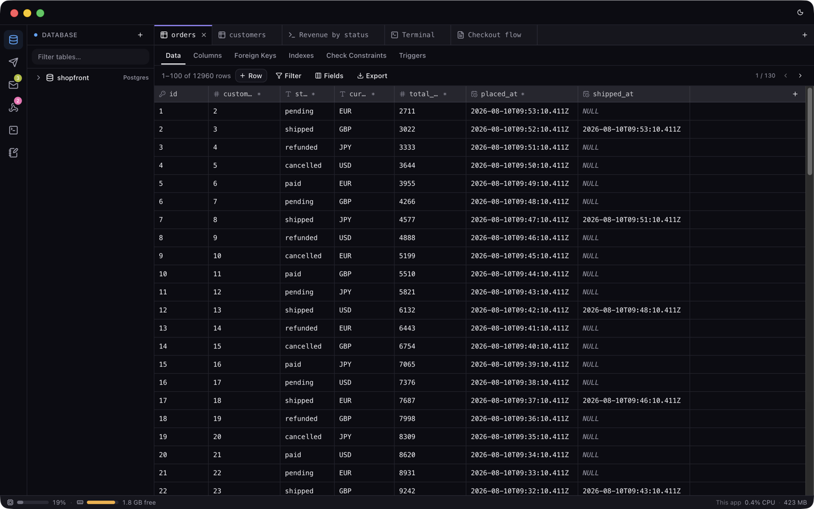
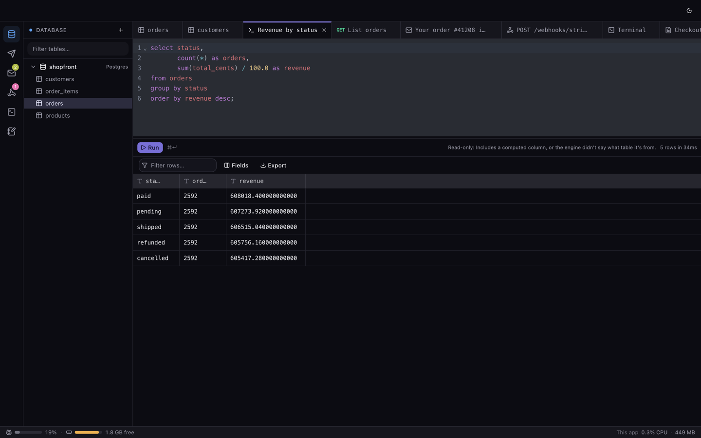
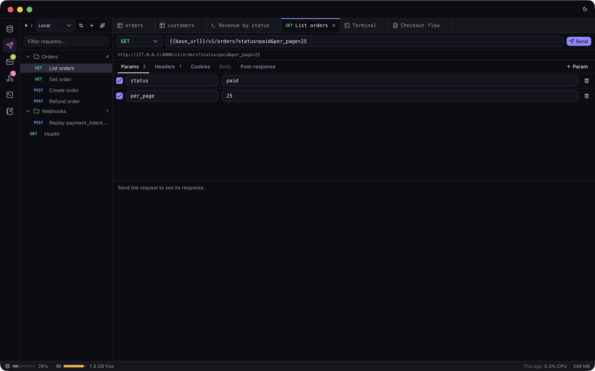
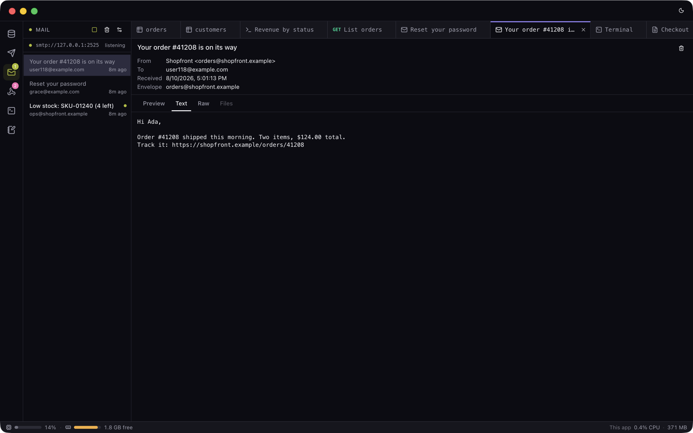
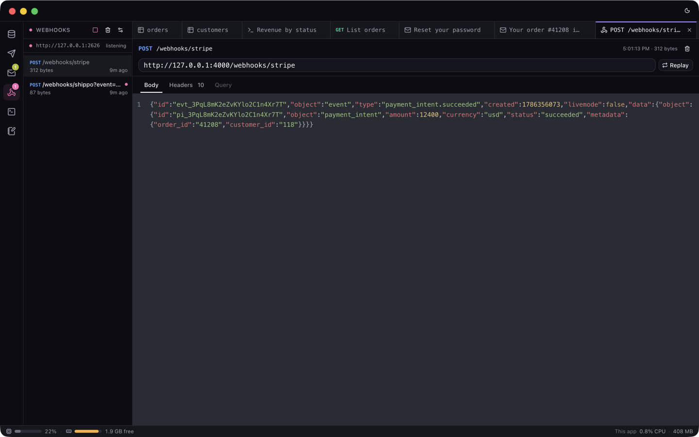
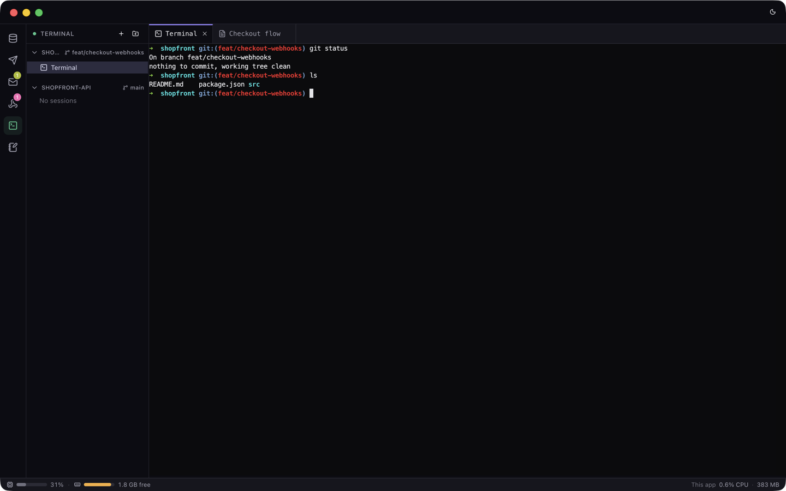
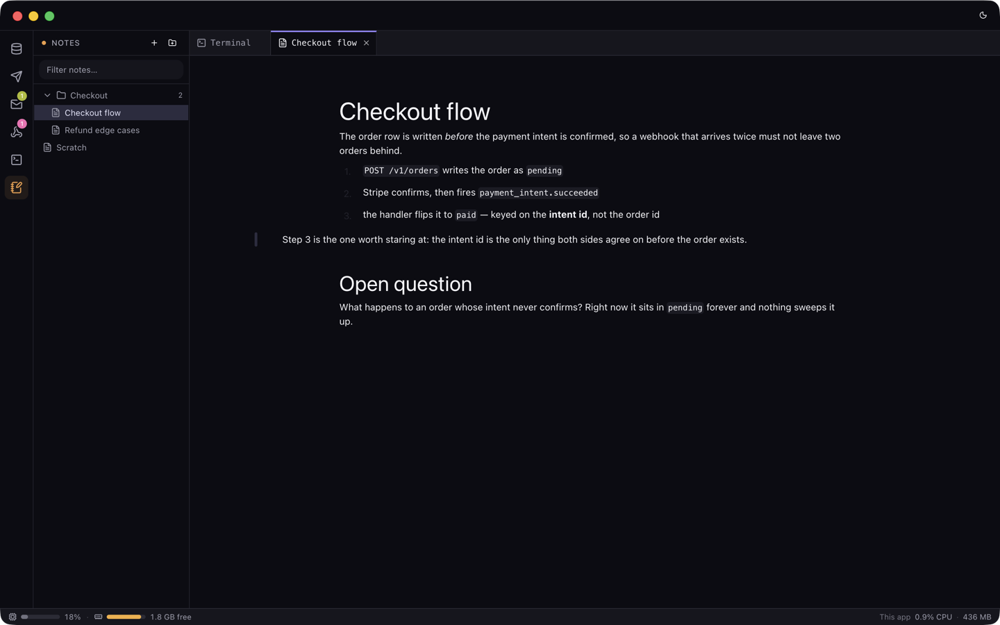

<div align="center">


# Tabula

**One window for the applications a project already needs.**

[](https://github.com/tabulapp/tabula/actions/workflows/ci.yml)
[](LICENSE)
[](https://electronjs.org)



</div>

---

Working on a project normally means half a dozen applications and half a dozen
window layouts: a database client, an HTTP client, a mail catcher, a request
bin, a terminal, and wherever the agent runs. Switching between them costs more
than any one of them saves.

Tabula makes each of them a tab in one window, the way an editor makes files
tabs. The database explorer, the API panel, the captures, the notes, the
terminal and the agent's chat open, switch and close the same way, and none of
them is a separate app to arrange on screen.

## What's in it

| Panel                   | What it replaces                                                                                                                                                                                               |
| ----------------------- | -------------------------------------------------------------------------------------------------------------------------------------------------------------------------------------------------------------- |
| **Database**            | A SQL client. Postgres and MySQL — schema tree, a data browser with a filter builder, a query console. Docker-managed databases a project owns, or ones you connect to.                                        |
| **API**                 | An HTTP client. Requests are sent from the main process, so there is no page origin, no CORS preflight, and forbidden headers go out as typed.                                                                 |
| **Mail** & **Webhooks** | Mailhog and a request-bin service. An SMTP sink and a catch-all HTTP endpoint on loopback, catching the mail the project sends and the callbacks fired at it. Any capture can be replayed verbatim at any URL. |
| **Terminal**            | A terminal, plus the agent. A `claude` session is one pty with two views — the terminal, and a chat reading the transcript the CLI writes.                                                                     |
| **Notes**               | A scratchpad. Markdown files filed in folders, edited in a WYSIWYG editor, left on disk as plain `.md`. `/drawing` opens an Excalidraw canvas and leaves the result in the note as an SVG.                     |

Some things are deliberately not what you'd expect. The Mail parser is not a
MIME library — the studio would otherwise behave differently depending on what
you happened to have installed. The AI features shell out to `claude -p` — the
CLI already installed for the Terminal panel — rather than an API needing a key.

There is one **workspace**, holding any number of **folders** — directories
already on this machine, worked on where they are. It is deliberately not
switchable: someone working across a frontend and its API has both open at
once, and a switch would take one of them, and every tab and session opened
against it, off the screen.

There is no git panel, no code search and no specs panel — all three were
removed rather than left hidden. Your editor and your shell already do the
first two, and a studio that did them worse would only be one more place to
look. The one thing Tabula still asks git is each folder's branch name, shown
beside the folder in the Terminal sidebar.

## A look at it

Every panel shares the strip along the top, so whatever you opened stays open
while you work somewhere else — a query you are half way through does not close
because you went to look at a webhook.

**Database.** Postgres and MySQL. The schema tree on the left, a table's rows
browsed and edited in place, and the query console as a tab like any other.



**API.** Requests are filed in folders that cascade headers and params onto
what they hold, and `{{variables}}` resolve against the environment picked in
the corner. Sent from the main process, so there is no page origin and no
preflight in the way.



**Mail and Webhooks.** Two servers on loopback and one implementation. Mail is
shown as the recipient would see it — rendered HTML, plain text, the raw
source, its attachments — and a captured webhook keeps every header it arrived
with, ready to be replayed at any URL.





**Terminal.** A session is a pty in a folder's own directory. The folders are
listed, added and removed here — beside the one thing they change — each with
the branch it is on. Pick `claude` instead of a shell and the same session
gains a chat view, reading the transcript the CLI writes.



**Notes.** Markdown, filed the way the API panel's requests are, and left on
disk as plain `.md` that grep and git can read without this app.



## Requirements

- **macOS 12 (Monterey) or newer**, Apple Silicon or Intel — each architecture
  has a build of its own — or **Linux x64** (AppImage) or **Windows x64**
- **[Bun](https://bun.sh) 1.3+** and **Node 20+**, only to build it from source
- **Docker**, only for a project's own Docker-managed databases
- **`claude` on your PATH**, only for agent sessions and the AI features

Neither Docker nor the CLI is needed to start the app, and each says so in the
place it would have been used.

**Platform support is honest about itself:** every release carries all three,
built by the same workflow, but Tabula is developed on macOS and that is where
it is actually used day to day. The Linux and Windows builds compile and the
test suite runs on Linux; they are far less travelled than that sentence makes
them sound. Reports are welcome; assume rough edges.

## Install

### macOS

```bash
curl -fsSL https://raw.githubusercontent.com/tabulapp/tabula/main/install.sh | bash
```

That is [`install.sh`](install.sh) in this repository. It picks the build for
your architecture, downloads it, and copies the app into `/Applications`,
quitting a running copy first. It is short and does nothing clever — reading it
before running it is a reasonable habit. Pin a version by passing one:

```bash
curl -fsSL https://raw.githubusercontent.com/tabulapp/tabula/main/install.sh | bash -s 0.0.3
```

The `.dmg` builds are on the
[Releases](https://github.com/tabulapp/tabula/releases) page, one per
architecture. Running the installer again is also how you update; there is no
in-app updater, because `electron-updater` wants a signed app.

**Why `curl` rather than the Releases page in a browser.** These builds are
**not signed with an Apple Developer ID and not notarized** — signing needs a
paid Apple Developer membership this app does not have yet. macOS marks
anything a browser, Mail or AirDrop hands over with `com.apple.quarantine`, and
Gatekeeper, finding no signature it trusts, reports the app as _"damaged and
can't be opened"_, which is misleading: nothing is damaged, it is unsigned.
`curl` sets no such attribute, so an app installed the way above opens
normally. Be clear about what that means — the check is being **skipped, not
passed**. You get the integrity of the transfer and no proof of who built the
file. A `.dmg` downloaded in a browser works too, but needs

```bash
xattr -dr com.apple.quarantine "/Applications/Tabula.app"
```

before it will open. If neither is a trade you want to make, build it yourself
below.

### Linux

The AppImage from the
[Releases](https://github.com/tabulapp/tabula/releases) page is the whole
install — there is nothing to unpack:

```bash
chmod +x Tabula-0.0.3-x64.AppImage
./Tabula-0.0.3-x64.AppImage
```

An AppImage needs FUSE, which some distributions no longer ship by default
(`sudo apt install libfuse2` on Debian and Ubuntu). Failing that,
`--appimage-extract-and-run` unpacks it to a temporary directory instead.

### Windows

Run the `.exe` from the [Releases](https://github.com/tabulapp/tabula/releases)
page. It is an NSIS installer and it is **not signed**, so SmartScreen will
show "Windows protected your PC" — _More info_ then _Run anyway_ is the way
past it, and the same caveat as macOS applies: you are skipping the check, not
passing it.

## Running it from source

Building it is also how you work on it:

```bash
git clone https://github.com/tabulapp/tabula.git
cd tabula
bun install
bun run dev      # bundles the main process, starts Vite, launches Electron at it
```

The rest:

```bash
bun run test     # every test file under test/
bun run lint
bun run typecheck
bun run build    # bundle the main process, preload, daemon and renderer
```

A `Makefile` wraps packaging: `make dmg` for this machine's architecture,
`make dmg-arm64` / `dmg-x64` / `dmg-universal`, `make app` for an unpacked
`.app` (faster for a smoke test), `make help` for the rest. Builds are unsigned
unless `SIGN=1`.

## How it fits together

One package, no workspaces.

```
src/
  main/        Electron main process — IPC handlers, store, daemon, servers
  preload/     the one bridge script, sandboxed
  renderer/    React 19, Vite, Tailwind v4, CodeMirror, xterm, Milkdown
    components/ui/   shadcn/ui
  shared/      the contract between main and renderer, types only
test/          plain bun scripts, no test framework
scripts/       dev, build and packaging entry points
resources/     icon source art
docs/design.md what each panel is for, and why
```

The Electron main process and the renderer **never import each other**.
Everything between them is a type in `src/shared/api.ts` plus a
channel name in the `IPC` map at the bottom of that file, wired through
`src/preload/index.ts` and `src/main/ipc.ts`. Adding a call means touching all
four, which is deliberate: the alternative is two sides that disagree about
what a call returns.

The workspace's state lives under `~/.tabula` — `manifest.json` for the
workspace, its folders, its databases and settings, and `workspace/` for the
panels' own files: saved requests, cookies, captures, notes and per-database
Docker data. A folder's own files are never copied under there; the manifest
records an absolute path and they are read where they are. Database passwords
are encrypted in the manifest and stripped field by field before a record
crosses to the renderer.

## Documentation

- **[`docs/design.md`](docs/design.md)** — the design document.
  What each panel is for and why it behaves as it does. Read this before
  changing one.
- **[`CONTRIBUTING.md`](CONTRIBUTING.md)** — how to get it running, the rules
  that aren't negotiable, and where the seams are if you want to add something.
- **[`SECURITY.md`](SECURITY.md)** — how to report a vulnerability, and what
  Tabula's security model actually is.
- **[`AGENTS.md`](AGENTS.md)** — the same ground as CONTRIBUTING, in a
  paragraph, for a coding agent.

## Contributing

Contributions are welcome, and the places designed to be added to are listed in
[CONTRIBUTING.md](CONTRIBUTING.md) — a new database engine, a new agent CLI, a
new panel. Small fixes need no ceremony; anything structural is worth an issue
first, for the chance that someone says "there is a reason it is like that"
before you have written it.

## License

[MIT](LICENSE).
